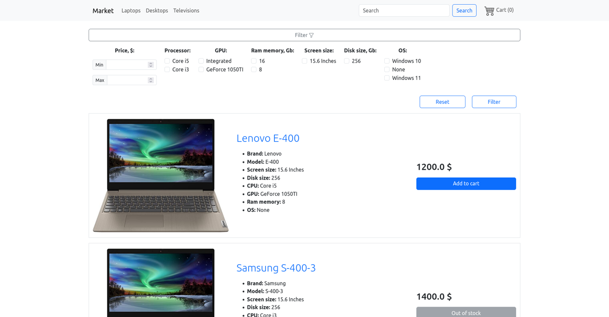

# Django_market

Project for learning.



Used components:

- Web framework: [django](https://github.com/django/django)
    - [django-tinymce](https://github.com/jazzband/django-tinymce)
- Database: [PostgreSQL](https://www.postgresql.org/)
- [Bootstrap](https://getbootstrap.com/) for styling
- [Docker](https://www.docker.com/) to make it work together

## Instructions

You need installed [Docker](https://www.docker.com/) on your machine to make it run without additional preparations.

First clone repository:

```
git clone https://github.com/dreamer20/django_market.git
```

Then set environment variable if you run it first time to make migrations and populate database:

```
export initial=true
```
or if it's Windows:

```
set initial=true
```

And lastly run command:

```
docker compose -f docker-compose.dev.yml up --build
```

By default application will be runnig at http://localhost:8000/

After initial start database will be populated some data. You can try log in to admin site with:

```
username: admin
password: secretpassword
```